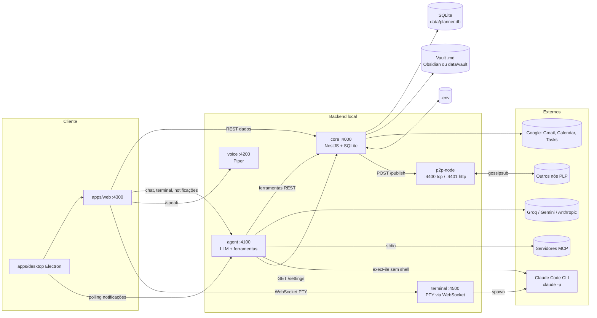
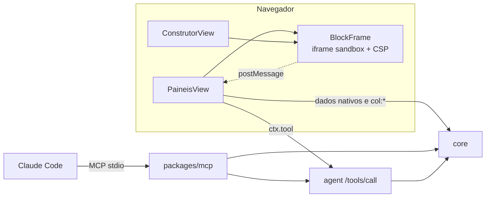
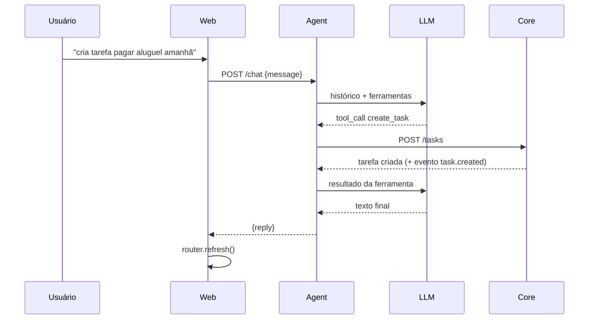
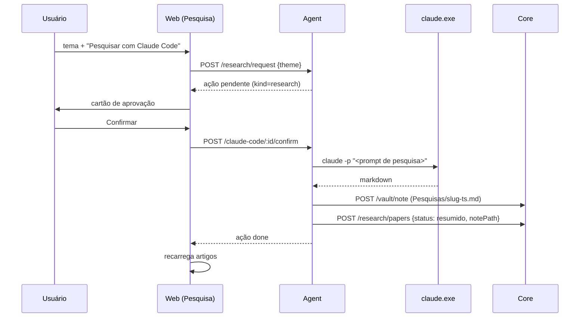
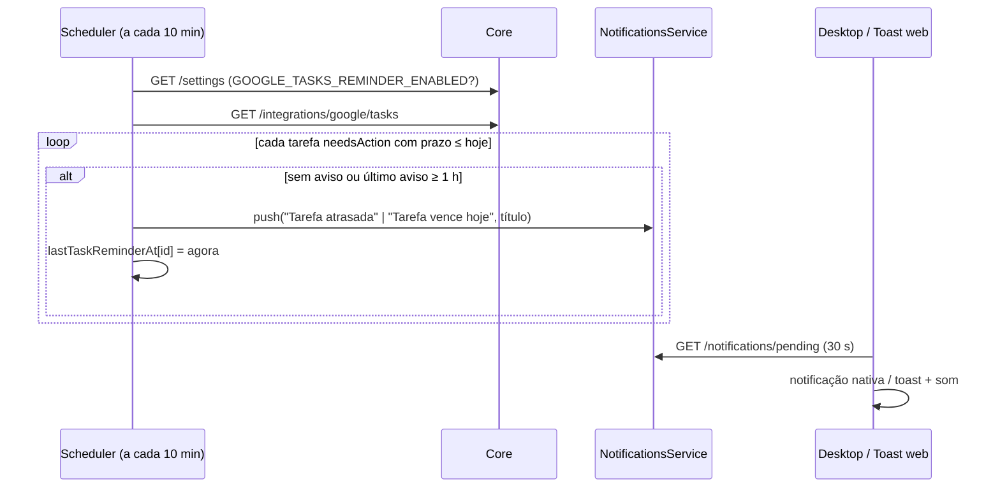

# Arquitetura

## 1. Visão geral

Monorepo `pnpm` com 5 pacotes de runtime, 1 pacote de tipos e 2 apps.

```
planner-life/
├── packages/
│   ├── shared/     tipos de domínio + protocolo PLP (compilado; os outros consomem o build)
│   ├── core/       NestJS + node:sqlite: fonte da verdade dos dados
│   ├── agent/      NestJS: LLM + ferramentas + MCP + Skills + Claude Code + rotinas proativas
│   ├── voice/      NestJS: TTS local (Piper), POST /speak → audio/wav
│   ├── terminal/   node-pty + ws: sessões PTY para a aba Terminal (só loopback)
│   ├── mcp/        servidor MCP (stdio) para o Claude Code: banco sob medida + ferramentas do Agent
│   └── p2p-node/   libp2p: descoberta, gossipsub, ponte HTTP local
├── apps/
│   ├── web/        Next.js (App Router): dashboard
│   └── desktop/    Electron: sobe o backend e abre a dashboard numa janela
├── .mcp.json       servidores MCP que o agente conecta como cliente
└── docs/
```

| Pacote                   | Stack                                                 | Porta                             | Responsabilidade única                                                                           |
| ------------------------ | ----------------------------------------------------- | --------------------------------- | ------------------------------------------------------------------------------------------------ |
| `@planner-life/core`     | NestJS 10 + `node:sqlite`                             | 4000                              | Guardar dados e regras; integrar Google e vault                                                  |
| `@planner-life/agent`    | NestJS + SDKs Groq(OpenAI)/Gemini/Anthropic + MCP SDK | 4100                              | Ser o "cérebro": conversar, chamar ferramentas, agendar avisos                                   |
| `@planner-life/voice`    | NestJS + Piper + `ws`                                 | 4200                              | Texto → fala; **chamada de voz** (relay WebSocket → Gemini Live, [VOICE-CALL.md](VOICE-CALL.md)) |
| `@planner-life/terminal` | Node + `@lydell/node-pty` + `ws`                      | 4500 (só 127.0.0.1)               | Sessões de terminal (PTY) para o dashboard                                                       |
| `@planner-life/mcp`      | `@modelcontextprotocol/sdk` (stdio)                   | — (processo filho do Claude Code) | Expor o Planner ao Claude como conectores MCP                                                    |
| `@planner-life/web`      | Next.js                                               | 4300                              | Interface                                                                                        |
| `@planner-life/p2p-node` | libp2p (tcp, noise, yamux, mdns, gossipsub, identify) | 4400 (TCP), 4401 (HTTP local)     | Transporte P2P                                                                                   |

## 2. Diagrama de componentes



## 3. Responsabilidades e fronteiras

### 3.1 Core (`packages/core`)

- **Único dono do banco e do `.env`.** Nenhum outro processo abre o SQLite; quem precisa de configuração pergunta por HTTP (`GET /settings`).
- Um módulo NestJS por domínio: `projects`, `tasks`, `memory`, `events`, `clients`, `subjects`, `study`, `research`, `messages`, `habits`, `vault`, `settings`, `integrations/google`, `p2p-bridge`. Infra global: `DatabaseModule` (token `PLANNER_DB`) e `EventBusModule`.
- Camadas: `controller` (validação de entrada, HTTP) → `service` (regras, eventos) → `repositories/*` (SQL puro, mapeamento linha→tipo).
- Toda mutação relevante: `EventsService.record()` (log durável em `events`) **e** `PlannerEventBus.publish()` (em memória → ponte P2P).

### 3.2 Agent (`packages/agent`)

- Não acessa o banco. Toda ferramenta é uma chamada REST ao Core (`coreFetch`), o que mantém o agente trocável (outro runtime poderia usar as mesmas rotas).
- `ToolRegistry` é o ponto único que os providers enxergam: `AGENT_TOOLS` (72) + `use_skill` + ferramentas MCP. Roteia `mcp__*`, `use_skill` e `run_claude_code` para tratadores próprios; o resto vai para `runTool`.
- `LlmProvider` (`groq`, `gemini`, `anthropic`) implementa o laço de tool-use; o schema de ferramenta é JSON Schema neutro adaptado por provider.
- `ClaudeCodeService`, `NotificationsService` e `SchedulerService` mantêm estado **em memória**.

### 3.3 Web (`apps/web`)

- `page.tsx` (Server Component) busca todos os dados em paralelo (`no-store`) e entrega ao `DashboardShell` (Client Component), que alterna entre as 11 views. Mutações chamam `lib/api.ts` e depois `router.refresh()`.
- `NEXT_PUBLIC_*_URL` definem para onde o navegador fala com cada serviço.

### 3.4 P2P (`packages/p2p-node`)

- Só transporte. `createPlannerNode` (libp2p) + `createHttpBridge` (`127.0.0.1:4401`). O envelope PLP é `{type, origin, createdAt, payload}` no tópico `planner-life/events/v1`.
- `peer:discovery` (mDNS) dispara `dial` explícito — só "descobrir" não conecta.

### 3.5 Desktop (`apps/desktop`)

- Não reimplementa nada: `spawn("pnpm", ["dev"])` e `spawn("pnpm", ["--filter","@planner-life/p2p-node","dev"])`, espera os health checks, abre a janela. Encerra a árvore com `taskkill /t /f` (Windows) ou `kill(-pid)`.
- `shell: true` aqui é seguro **porque os argumentos são literais fixos**. (Contraste com o Claude Code, §6.2.)

### 3.6 Terminal (`packages/terminal`)

- Serviço isolado que expõe **sessões PTY** ao dashboard. Cada sessão é um processo real (Claude Code interativo, `pnpm cli` ou um shell) dentro de um pseudoterminal (`@lydell/node-pty`: binários prontos para Windows, macOS e Linux x64/ARM64, sem compilar).
- **Sessões vivem no servidor, não na aba:** desconectar o WebSocket não mata o processo. Cada sessão guarda os últimos 256 KB de saída e os reenvia ao reconectar; ao reanexar, o servidor faz um "empurrão" de resize para o app de tela cheia se redesenhar. Sessões sem cliente há 12 h (ou encerradas há 1 h) são recolhidas.
- **Perfis por lista fixa** (`claude`, `automacao`, `agent`, `shell`): o navegador só envia o _nome_ do perfil; comando, argumentos e pasta saem do servidor. Nenhum texto do navegador vira comando.
- **Ambiente dos terminais:** o do usuário, **sem** o conteúdo do `.env` do projeto (chaves de API não vazam para o shell) e **sem** os marcadores de sessão do Claude Code (`CLAUDECODE`, `CLAUDE_CODE_*`, tokens de mensagens). Sem essa limpeza, um serviço iniciado de dentro de outra sessão do Claude Code faria o Claude embutido se achar uma sessão "filha" (sem gravar transcrição) e o shell herdaria credenciais alheias. Só `CLAUDE_CODE_USE_*` (escolha de provedor) é mantido.
- Interface: `TerminalPane` (xterm.js, usado também pelos itens do workspace — §3.8) e, na aba **Terminal (prompt)**, `TerminalCanvas` (janelas arrastáveis/redimensionáveis e navegação do fundo, layout em `localStorage`). A aba preenche exatamente a altura disponível para o rodapé dos terminais (onde o Claude Code mostra a caixa de entrada) nunca ficar fora da tela. Protocolo em [API.md §5](API.md).

### 3.7 Construtor, banco sob medida e MCP

- **Core** guarda `blocks`, `dashboards` (layout em JSON com duas geometrias por item) e `collections`/`records` (esquema + registros JSON validados). Módulos `builder` e `data`; blocos/painéis embutidos são reaplicados a cada subida (`onModuleInit`).
- **Web**: `PaineisView` (grade/canvas), `ConstrutorView` (editor + preview), `BlockFrame` (iframe isolado + ponte + modais/avisos em portal) e `builder-api.ts` (recursos → rotas do Core, permissões). O runtime do iframe e o design system estão em `lib/block-runtime.ts` e `lib/design-system.ts`.
- **Ponte**: iframe → `postMessage` → `BlockFrame` confere `approved` + `read`/`write`/`tools` → `fetch` ao Core (`/tasks`, `/data/collections/<nome>/records`…) ou ao Agent (`/tools/call`).
- **Agent**: 7 ferramentas de blocos/painéis, skill `criar-bloco`, e `GET /tools`/`POST /tools/call` (loopback + `Origin` permitida) que servem à ponte e ao MCP.
- **MCP** (`packages/mcp`): processo stdio iniciado pelo Claude Code. Proxy de `GET /tools` + `POST /tools/call` do Agent, mais ferramentas próprias de banco que chamam o Core. Ver [MCP.md](MCP.md).



### 3.8 Workspace (canvas) e shell visual

- **Core** (`workspaces/`): tabela `workspaces` com `nodes` e `viewport` em JSON. O serviço valida e normaliza tudo que chega (tipo, `data` por tipo, limites de coordenada/tamanho/zoom, ≤ 200 itens) e cria o workspace **Início** na primeira execução. Guarda só **layout**: sessões PTY continuam no serviço `terminal` e o código dos blocos no Construtor — o item guarda apenas `sessionId`/`blockId`.
- **Web — shell** (`app/dashboard-shell.tsx`, `app/rail.tsx`): `Active = workspace | módulo`. A barra lateral (`Rail`) lista workspaces e módulos; os módulos são as telas clássicas, montadas num contêiner `.legacy`. `WorkspaceHost` busca o workspace fresco a cada abertura (o canvas grava direto no Core, então o estado do shell fica velho). O assistente (`ChatPanel`) abre como gaveta.
- **Web — canvas** (`app/workspace/WorkspaceCanvas.tsx`): estado `nodes` + `viewport {x,y,zoom}`. Posição na tela = `viewport + coordenada × zoom`; o **zoom é semântico** — tamanhos e posições são multiplicados, o xterm recebe fonte proporcional (a seleção de texto continua exata) e os blocos são reduzidos com `transform: scale` dentro de uma caixa do tamanho natural. Arrastar/redimensionar/pan usam `trackPointer` (`lib/pointer.ts`, ouvintes no `window`, seguro contra `pointercancel`); `Ctrl`+roda é capturado na fase de captura para não virar zoom do navegador.
- **Persistência:** debounce de 700 ms e _flush_ ao desmontar, numa **fila** por canvas; cada PATCH envia `baseUpdatedAt` (a última versão vista) e atualiza a base com a resposta. `409` ⇒ outra janela gravou: o canvas para de gravar e mostra o aviso. `getWorkspace` espera a gravação pendente do mesmo id (`workspace-api.ts`) para reabrir sem ler layout velho. Renomear não muda a versão do layout.
- **Tema:** atributo `data-theme` no `<html>` (script inline em `layout.tsx` evita o "flash"), escolha em `localStorage` (`planner.theme`), `lib/theme.ts` (`useTheme`/`setTheme`). Tokens escuros em `globals.css`; `dsCss(tema)` entrega variáveis claras/escuras aos iframes dos blocos.
- **Segurança:** nenhuma mudança no modelo — blocos no canvas passam pelo mesmo `BlockFrame` (sandbox, CSP, aprovação e permissões por chamada); terminais só por perfil fixo (§6.1.1); o Core não confia no navegador para o formato de `nodes` (sanitiza `data`).

### 3.9 Automações (motor nativo) e chamada de voz

- **Automações** (`packages/core/src/automations`): motor de grafo no Core (nós → itens → portas, ordem topológica, execução com dados por nó, simulação, expressões seguras sem `eval`, cron) e runner que dispara gatilhos agendados/por evento. O editor é React Flow no canvas (`apps/web/app/automation`). O MCP ganha `automation_nodes`, `list_automations`, `get_automation`, `save_automation`, `run_automation` (só simulação), `automation_runs`, `delete_automation`; tudo que o Claude salva nasce **inativo** e só o usuário ativa. O Agent ganha avisos (`create_reminder`, `list_reminders`, `cancel_reminder`, `notify`). O canvas ganhou o nó `automation` e o terminal o perfil `automacao`. Detalhes: [AUTOMATIONS.md](AUTOMATIONS.md).
- **Chamada de voz**: navegador (`lib/live-call.ts`) ⇄ `voice` `/live` (WebSocket local) ⇄ Gemini Live. O relay guarda a chave, declara as ferramentas do Agent como funções do Gemini (sem as destrutivas) e executa cada `toolCall` em `/tools/call`. Detalhes: [VOICE-CALL.md](VOICE-CALL.md).

## 4. Fluxos principais

### 4.1 Mensagem de chat com ferramenta



Erros de ferramenta não derrubam a conversa: viram `{error: "..."}` devolvido ao modelo.

### 4.2 Pesquisa via Claude Code



### 4.3 Aviso de Google Tasks (repetição horária)



Concluir a tarefa no Google a tira da lista de `needsAction` e os avisos param.

### 4.4 Evento de domínio → rede

`Service.create()` → `events.record()` (SQLite) → `eventBus.publish()` →
`P2pBridgeService` → `POST 127.0.0.1:4401/publish` (timeout 1,5 s) →
`publishPlpEvent()` → gossipsub. Se o nó P2P estiver fora do ar, o Core segue
e só registra em `debug`.

### 4.5 OAuth do Google (multi-conta)

`GET /integrations/google/auth` redireciona ao consentimento com
`access_type=offline` e `prompt=consent select_account` (força o seletor de
conta) → `/callback?code=` troca o código, descobre o e-mail por `userinfo`,
grava o token em `integration_tokens` sob `google:<email>`, sincroniza o
Gmail dessa conta e redireciona para `WEB_APP_URL/?google=connected`. Tokens
expirados (ou a < 60 s de expirar) são renovados com o `refresh_token`.

## 5. Decisões de arquitetura

| Decisão                                    | Motivo                                                           | Consequência                                                                         |
| ------------------------------------------ | ---------------------------------------------------------------- | ------------------------------------------------------------------------------------ |
| `node:sqlite` em vez de ORM/driver nativo  | Zero dependência nativa; roda em Raspberry Pi                    | Requer Node ≥ 22.5; API ainda experimental                                           |
| Agente só fala HTTP com o Core             | Trocar de runtime de agente sem mexer no dado                    | Uma chamada de rede por ferramenta                                                   |
| Schema de ferramenta neutro                | Mesmas ferramentas em todos os providers                         | Adaptadores finos por provider                                                       |
| Groq via SDK `openai` com `baseURL`        | API compatível; sem cliente HTTP manual                          | —                                                                                    |
| `.env` como fonte única de configuração    | Simples, editável à mão                                          | Serviços leem no boot; mudanças por UI exigem reinício (exceto o que é lido ao vivo) |
| Settings mascara segredos                  | Chave nunca volta ao navegador                                   | Reenviar exige digitar de novo                                                       |
| Rotinas leem `GET /settings` a cada tick   | Liga/desliga e horário valem sem reiniciar                       | Cron roda com mais frequência do que o evento em si                                  |
| Vault = pasta de `.md`                     | Obsidian não precisa de API nem plugin                           | Sem índice; busca linear                                                             |
| Claude Code sem shell                      | Evitar injeção via prompt                                        | Precisa localizar o `.exe` real no Windows                                           |
| Pedido pendente para chamadas vindas da IA | Agente autônomo com acesso total à máquina é perigoso sem humano | Fila em memória                                                                      |
| Web Audio para o som                       | Sem arquivo de áudio para versionar                              | Precisa de gesto do usuário para liberar                                             |
| Ponte HTTP P2P só em loopback              | Core e nó são processos distintos; sem auth                      | Só funciona na mesma máquina                                                         |
| Migrações por `PRAGMA table_info`          | `CREATE TABLE IF NOT EXISTS` não altera tabelas existentes       | Cada coluna nova precisa de uma verificação manual                                   |

## 6. Modelo de segurança

### 6.1 Superfície de rede

Todos os serviços chamam `app.listen(port)` (todas as interfaces) e habilitam
CORS irrestrito. **Não há autenticação.** A ponte P2P é a única que escuta só
em `127.0.0.1`. Consequências e recomendações estão em
[SPEC.md §7–8 (L1)](SPEC.md). Para uso fora de uma rede confiável: bloquear
4000–4401 no firewall ou colocar um proxy com autenticação na frente.

### 6.1.1 Serviço de terminal

Um terminal exposto é execução remota de código, e **WebSocket não passa por CORS**: sem checagem, qualquer site aberto no navegador poderia conectar em `ws://127.0.0.1:4500` e digitar comandos. Por isso o serviço:

1. escuta **só em `127.0.0.1`** (nada na rede local alcança);
2. exige `Origin` na lista permitida (`http://localhost:4300`, `http://127.0.0.1:4300` + `TERMINAL_ALLOWED_ORIGINS`) em todas as rotas exceto `/health` — sem `Origin` ou com `Origin` estranha → 403, inclusive no upgrade do WebSocket;
3. exige `Host` de loopback com a porta certa (barra _DNS rebinding_);
4. aceita só perfis da lista fixa, no máximo 8 sessões, entrada de até 64 KB por mensagem.

Ainda assim, **qualquer processo local do seu usuário** pode forjar o `Origin`. O modelo assume que a máquina é sua.

### 6.1.2 Blocos do dashboard (código de terceiros)

Modelo completo em [BUILDER.md §3](BUILDER.md): iframe `sandbox="allow-scripts"` (origem opaca) com CSP `connect-src 'none'` e `script-src` por _nonce_; dados/ferramentas só pela ponte com permissões declaradas **e aprovadas**; `run_claude_code`/`use_skill` vetadas; `/tools/call` do Agent só de loopback + `Origin` conhecida; limites de taxa/tamanho/profundidade. Verificado com um bloco hostil (13 tentativas de escape, todas contidas).

### 6.2 Execução de comandos

- **Claude Code** — `execFile(claude.exe, ["-p", prompt])` **sem shell**. No Windows, `shell: true` faria o Node concatenar (não escapar) os argumentos, e o Node avisa isso com `DEP0190`. O `.cmd` do PATH também não pode ser executado sem shell (`spawn EINVAL`), então o serviço replica a lógica do shim: escolhe a versão mais recente em `%APPDATA%\Claude\claude-code\` e chama o `.exe`. Fora do Windows usa `claude` do PATH.
- **Piper** — `spawn(bin, ["--model", m, "--output_file", f])` sem shell; o texto vai por `stdin`.
- **Terminal (PTY)** — `pty.spawn` com perfis fixos e **sem** interpolar texto do navegador. O `agent` no Windows usa `cmd.exe /d /c "pnpm cli"` (literal fixo) porque `pnpm` é um shim `.cmd`. É uma **shell de verdade**: quem a controla tem os poderes do seu usuário (ver §6.1.1).
- **MCP** — `StdioClientTransport` executa os comandos definidos em `.mcp.json` (arquivo confiável, do usuário).

### 6.3 Dados sensíveis

| Dado                           | Onde                                                           | Proteção                                              |
| ------------------------------ | -------------------------------------------------------------- | ----------------------------------------------------- |
| API keys e OAuth client secret | `.env`                                                         | Fora do git (`.gitignore`); mascaradas em `/settings` |
| Tokens OAuth Google            | SQLite `integration_tokens`                                    | Só em disco local; sem criptografia em repouso        |
| Conteúdo de e-mails            | SQLite (`messages`, só assunto/prévia) e Gmail ao vivo (corpo) | Corpo não é persistido                                |
| Notas                          | Vault em disco                                                 | Bloqueio de _path traversal_                          |

### 6.4 Escopos OAuth solicitados

`gmail.readonly`, `calendar` (escrita), `tasks`, `userinfo.email`.

## 7. Portas e processos

| Serviço  | Porta | Escuta    | Origem da porta                                                                                                        |
| -------- | ----- | --------- | ---------------------------------------------------------------------------------------------------------------------- |
| core     | 4000  | todas     | `CORE_PORT`                                                                                                            |
| agent    | 4100  | todas     | `AGENT_PORT`                                                                                                           |
| voice    | 4200  | todas     | `VOICE_PORT`                                                                                                           |
| web      | 4300  | todas     | fixa em `apps/web/package.json` (`next dev -p 4300`); a variável `WEB_PORT` do `.env` **não é lida por nenhum código** |
| p2p TCP  | 4400  | todas     | `P2P_TCP_PORT`                                                                                                         |
| p2p HTTP | 4401  | 127.0.0.1 | `P2P_HTTP_PORT`                                                                                                        |
| terminal | 4500  | 127.0.0.1 | `TERMINAL_PORT`                                                                                                        |

`pnpm dev` sobe shared (watch), core, agent, web, voice e terminal com `concurrently`.
O `p2p-node` é iniciado à parte (`pnpm dev:p2p`) — o app desktop inicia os dois.
