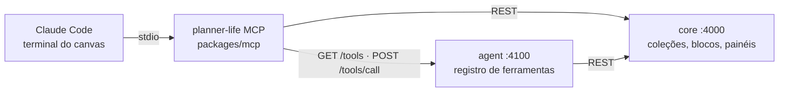

# Claude como construtor: o servidor MCP do Planner Life

Você descreve a **sua situação** em linguagem natural; o Claude Code monta o **banco de dados** (coleções), os **blocos** (telas) e o **painel em canvas**, usando o servidor MCP `planner-life`. Nada de editar código para isso.

## 1. Usar

Pré-requisitos: stack rodando (`pnpm dev`), MCP compilado (`pnpm build:mcp`; o `pnpm dev`, `pnpm desktop` e os instaladores já compilam) e o Claude Code instalado.

O projeto já traz o servidor em `.mcp.json`:

```json
{ "mcpServers": { "planner-life": { "command": "node", "args": ["packages/mcp/dist/index.js"] } } }
```

**Dentro do Planner Life:** aba **Terminal → Canvas → + Claude Code** (abre na pasta do projeto, então o `.mcp.json` vale; na primeira vez o Claude Code pede para você aprovar o servidor). Depois:

```
/mcp__planner-life__construir-sistema Sou personal trainer, tenho 15 alunos, cobro mensalidade…
```

ou simplesmente escreva a situação e peça: _"use o planner-life e construa isso"_.

**De qualquer pasta** (registro de usuário, caminho absoluto) — o `.mcp.json` só vale com o Claude aberto na raiz do projeto:

```bash
pnpm mcp:install            # node scripts/install-mcp.mjs (Windows, macOS e Linux)
pnpm mcp:install --check    # mostra se está registrado e conectado (de fora do projeto)
pnpm mcp:install --remove   # desfaz
```

O script acha o Claude Code (app desktop ou CLI), compila o MCP se preciso, registra `planner-life` com o caminho absoluto do `node` e do servidor (`claude mcp add -s user`) e confere a conexão. É idempotente. `--scope local` registra só para você neste projeto. Os instaladores (`install.ps1 -WithMcp` / `install.sh --with-mcp`) também oferecem esse passo.

**Sem interface** (também serve para testar):

```bash
claude -p --mcp-config .mcp.json --strict-mcp-config --allowedTools "mcp__planner-life" < situacao.txt
```

Ao terminar, abra **Painéis** (o painel novo) e, em **Construtor**, **revise e aprove** cada bloco: os blocos criados pelo Claude nascem _aguardando aprovação_ e não acessam dados até você aprovar.

## 2. O que o Claude recebe

### Ferramentas (84)

| Origem                                                            | Ferramentas                                                                                                                                                                                                                 |
| ----------------------------------------------------------------- | --------------------------------------------------------------------------------------------------------------------------------------------------------------------------------------------------------------------------- |
| **Banco sob medida** (neste servidor)                             | `list_collections` `save_collection` `delete_collection` `list_records` `save_record` `import_records` `delete_record`                                                                                                      |
| **Guia**                                                          | `planner_guide`                                                                                                                                                                                                             |
| **Automações** (neste servidor, [AUTOMATIONS.md](AUTOMATIONS.md)) | `automation_nodes` `list_automations` `get_automation` `save_automation` `run_automation` (só simulação) `automation_runs` `delete_automation` — o Claude monta automações **como rascunho**; não há ferramenta para ativar |
| **Construtor** (via Agent)                                        | `list_blocks` `get_block` `save_block` `delete_block` `list_dashboards` `save_dashboard` `delete_dashboard`                                                                                                                 |
| **Todo o resto do Planner** (via Agent)                           | tarefas, projetos, memória, CRM, estudos, pesquisa, hábitos, inbox, Google Tasks/Calendar, notas do vault… (as mesmas ferramentas do agente)                                                                                |
| **Servidores MCP externos** configurados em `.mcp.json`           | também aparecem (o Agent os expõe)                                                                                                                                                                                          |

Não aparecem: `run_claude_code` e `use_skill`.

As ferramentas do Agent são **descobertas dinamicamente** (`GET /tools`): uma ferramenta nova no Agent vira ferramenta MCP sem mudar este pacote.

### Prompt e recurso

- Prompt **`construir-sistema`** (argumento `situacao`): entrega o guia + sua situação + o fluxo a seguir.
- Prompt **`construir-automacao`** (argumento `pedido`): descreva em português o que deve acontecer e o Claude monta a automação (rascunho para você ativar).
- Recurso **`planner://guia-construtor`**: o guia em Markdown (coleções, blocos, design system, modais, painéis, regras).

## 3. Fluxo que o Claude segue

1. Pergunta **no máximo 3 coisas** e só se mudarem o modelo; senão assume e diz o que assumiu.
2. **Coleções** (`save_collection`) por entidade; dados iniciais com `import_records`.
3. **Blocos** (`save_block`): indicadores, lista/tabela por coleção com cadastro/edição em **modal**, e o que for específico. Usa só as classes do design system.
4. **Painel** (`save_dashboard`, `mode: "canvas"`) com os blocos posicionados.
5. Resume o que criou e o que você precisa aprovar.

## 4. Evoluir o próprio sistema

Blocos e coleções cobrem a maior parte. Quando não bastarem, o Claude Code na aba Terminal já tem acesso ao repositório: o guia manda trabalhar em **branch/worktree**, rodar `pnpm typecheck`, mostrar o diff e **nunca** commitar/dar push sem você pedir, nem tocar em `.env`/`data/`. Isso é uma orientação, não uma trava técnica.

## 5. Como funciona por dentro



- O servidor fala **stdio** (stdout é só o protocolo; logs vão para stderr).
- Ferramentas de banco: implementadas aqui, chamam o Core.
- Demais ferramentas: `GET /tools` (nome, descrição, `inputSchema`) do Agent e `POST /tools/call`. O Agent só aceita esses endpoints de **loopback** e, se houver `Origin`, de origem permitida.
- O Agent **ignora** o servidor chamado `planner-life` em `.mcp.json` para não enxergar as próprias ferramentas de volta.
- Se o Agent estiver fora do ar, o servidor expõe só as ferramentas de banco e o guia (e loga o motivo).

Variáveis (opcionais): `PLANNER_CORE_URL` (padrão `http://localhost:4000`), `PLANNER_AGENT_URL` (padrão `http://localhost:4100`).

## 5. Limites

- O Core não tem autenticação (ver [SPEC.md §8](SPEC.md)): qualquer processo local pode chamar as ferramentas do MCP. O modelo assume a máquina como confiável.
- Saída de ferramenta é cortada em 60 000 caracteres; `import_records` aceita até 500 linhas por chamada.
- A qualidade do resultado depende do modelo e da clareza da sua descrição; **sempre revise** os blocos antes de aprovar.
